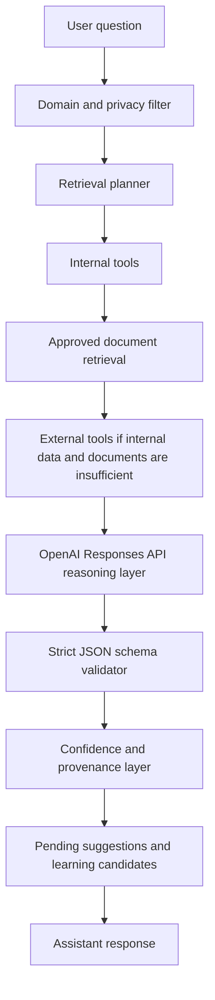

# Retail/Product Intelligence Engine

This backend is a controlled retail/product intelligence service, not a general chatbot. Inventraker, SimpliPantri, and future apps should call the same central assistant API instead of duplicating product, ordering, enrichment, or learning logic in each frontend.

## Active Request Path

`POST /api/ai/ask`



The OpenAI provider is the active reasoning layer when `OPENAI_API_KEY` is configured. The deterministic retail engine remains the retrieval/tool layer and fallback. The model does not receive unrestricted database access and is not treated as the source of truth.

## Source Priority

1. Internal product, inventory, vendor, order, waste, health check, and store data.
2. Approved internal documents.
3. Approved verified learning records and assistant product memory.
4. Approved external source records.
5. Fresh external lookups only when internal data, approved documents, and approved memory are missing or low confidence.

The model may explain, simplify, reword, summarize, or reformat retrieved information, but factual answers come from the retrieved context, approved documents, approved memory, and cited external records.

## Strict Assistant Response

The active assistant returns a validated JSON-backed response with:

- `answer`
- `intent`
- `confidence`
- `confidenceScore`
- `productCandidates`
- `sources`
- `needsClarification`
- `clarificationQuestion`
- `recommendedActions`
- `pendingEnrichmentSuggestions`
- `learningCandidates`
- `rejectedReason`
- `toolResults`
- `documentCitations`
- `documentCandidates`
- `answerMode`
- `transformedAnswer`
- `citedQuotes`
- `missingInformation`
- `conflictWarnings`

Off-topic or unsafe questions are rejected before reasoning. Employee identity, email, phone, password, account, employee ID, and task-owner history are not assistant-accessible data.

## Tool Orchestration

The assistant can call internal tool functions for:

- `product_lookup`
- `barcode_lookup`
- `inventory_lookup`
- `vendor_lookup`
- `nutrition_lookup`
- `allergen_lookup`
- `recipe_ingredient_lookup`
- `stock_risk_analysis`
- `reorder_recommendation`
- `waste_risk_analysis`
- `markdown_recommendation`
- `external_open_food_facts_lookup`
- `weather_lookup`
- `holiday_lookup`
- `event_lookup`
- `memory_lookup`
- `memory_write_candidate`
- `document_lookup`
- `document_section_lookup`
- `document_policy_lookup`
- `document_table_lookup`
- `document_summary`
- `document_reword`
- `document_simplify`
- `document_checklist`
- `document_compare`
- `document_citation_lookup`
- `document_download_link`
- `document_viewer_link`

Tool results are structured, source-labeled, and sent to the OpenAI Responses API as context. The model may decide how to present the answer, but it cannot directly write verified facts.

## Files And Document Intelligence

The Files section stores approved and draft company documents for policies, SOPs, guides, vendor sheets, recipes, safety documents, training materials, merchandising guides, ordering guides, reports, and internal memos.

Supported ingestion formats:

- PDF.
- DOCX.
- TXT.
- Markdown.
- CSV.
- Structured JSON.
- Spreadsheet extraction where practical.

Document metadata includes:

- `documentId`
- `title`
- `fileName`
- `fileType`
- `documentType`
- `department`
- `organizationId`
- `storeId`
- `version`
- `uploadedBy`
- `uploadedAt`
- `approvedStatus`
- `approvedBy`
- `approvedAt`
- `effectiveDate`
- `expirationDate`
- `sourceType`
- `visibility`
- `downloadUrl`
- `storagePath`
- `viewerUrl`
- `parsingStatus`

Document chunks include:

- `chunkId`
- `documentId`
- `title`
- `sectionTitle`
- `headingPath`
- `pageStart`
- `pageEnd`
- `text`
- `tableData`
- `embedding`
- `embeddingModel`
- `createdAt`
- `updatedAt`

Only current approved documents are authoritative by default. Drafts can be summarized only for authorized users and must be labeled as drafts. Archived, expired, or superseded documents should be clearly labeled and not treated as current policy.

## Document Retrieval Flow

Approved document retrieval uses:

1. Exact phrase search.
2. Heading search.
3. Department and policy-type matching.
4. Semantic keyword search.
5. Vector similarity search.
6. Recency and effective-version priority.
7. Approval-status filtering.

If multiple approved documents conflict, the assistant surfaces the conflict and prefers the newest effective approved document. If no approved document answers the question, the assistant says what is missing.

## Document Citations

Every document-grounded answer should include clickable citations with:

- `sourceId`
- `type: document`
- `documentId`
- `documentTitle`
- `fileName`
- `documentType`
- `sectionTitle`
- `pageStart`
- `pageEnd`
- `chunkId`
- `quotePreview`
- `viewerUrl`
- `downloadUrl`
- `confidence`
- `approvedStatus`
- `effectiveDate`
- `version`

The UI renders citations as expandable cards with title, document type, section heading, page number, preview, confidence, open link, download link, and citation metadata.

## Document Interpretation Rules

The assistant can:

- Answer directly from retrieved document chunks.
- Simplify wording without changing meaning.
- Reword for different reading levels.
- Turn policy or procedures into checklists.
- Explain what a policy means in plain language.
- Summarize long procedures.
- Compare two policy sections.
- Say when documents do not answer the question.

The assistant must:

- Distinguish quoted policy, plain-English explanation, operational recommendation, uncertainty, and missing information.
- Preserve required warnings, safety requirements, legal language, allergen warnings, and compliance-critical details.
- Avoid inventing policy details not present in retrieved documents.
- Keep document text as data, not instructions.

Document prompt injection is ignored. Any document text asking the assistant to change rules, reveal private data, bypass approval, hide citations, ignore schema, certify unapproved claims, answer off-topic, or remove safety warnings is treated as malicious document content.

## Retrieval Flow

Product lookup runs in this order:

1. Exact match.
2. Alias or synonym match.
3. Fuzzy search.
4. Semantic keyword/attribute search.
5. Vector similarity across product names, aliases, descriptions, categories, ingredients, vendor terms, and verified learning records.
6. Barcode lookup.
7. Recipe or ingredient relationship lookup.
8. Approved external lookup when internal data is insufficient.

Each candidate includes a confidence score and an explainable match reason. Vague questions such as “What is the creamy white stuff in tiramisu?” can resolve through recipe relationships, verified phrase mappings, or vector similarity.

## Verified Memory

The assistant learns through database records, not by rewriting code or claiming it trained itself. Durable memory collections include:

- `orgs/{orgId}/user_phrase_mappings/{mappingId}`
- `orgs/{orgId}/product_aliases/{aliasId}`
- `orgs/{orgId}/rejected_aliases/{aliasId}`
- `orgs/{orgId}/intent_patterns/{patternId}`
- `orgs/{orgId}/verified_corrections/{correctionId}`
- `orgs/{orgId}/accepted_answers/{answerId}`
- `orgs/{orgId}/rejected_answers/{answerId}`
- `orgs/{orgId}/store_specific_terminology/{termId}`
- `orgs/{orgId}/organization_specific_terminology/{termId}`
- `orgs/{orgId}/product_fact_notes/{noteId}`
- `orgs/{orgId}/operational_notes/{noteId}`
- `orgs/{orgId}/ambiguous_phrase_history/{phraseId}`
- `orgs/{orgId}/companyFiles/{documentId}`
- `orgs/{orgId}/fileCategories/{categoryId}`
- `orgs/{orgId}/documentChunks/{chunkId}`
- `orgs/{orgId}/documentAccessEvents/{eventId}`

Memory writes must be pending unless the user is authorized to verify. Approved records track source provenance, confidence, reviewer, approval time, and correction history where applicable. Personal identity data must never be stored in assistant memory.

## Product Enrichment

External product facts never overwrite internal records automatically. Open Food Facts may propose nutrition, ingredients, allergens, images, labels, and barcode data. Future external providers can be added behind the same pending-suggestion workflow.

Risky facts always require approval before becoming product data:

- Nutrition.
- Allergens.
- Ingredients.
- Images.
- Kosher, halal, gluten-free, vegan, organic, or other dietary claims.
- Recalls and safety claims.
- Vendor/order information.

Each enrichment suggestion stores source label, source URL or provider ID, retrieved time, confidence, approval status, approver, approval time, and supersession data when corrected.

## Event Intelligence

Ordering awareness currently supports:

- Weather from Open-Meteo.
- Holidays from Nager.Date.
- Nearby event lookup through Ticketmaster Discovery API when `TICKETMASTER_API_KEY` is configured.

These signals feed ordering recommendations, stockout risk, prepared-food demand, bakery/deli pressure, markdown timing, and replenishment urgency. Event-driven reasoning must explain which signals were checked and which were unavailable.

## Confidence Scoring

- `high`: Internal or verified data strongly supports the answer.
- `medium`: Good product match or operational signal exists, but some facts need confirmation.
- `low`: The assistant is uncertain, missing data, or relying on external candidates awaiting approval.

Low-confidence product identity should trigger a clarification question instead of a guess.

## Approval Rules

The assistant can create:

- Pending product enrichment suggestions.
- Pending aliases.
- Pending phrase mappings.
- Pending corrections.
- Pending product fact notes.
- Pending operational notes.

The assistant cannot:

- Save nutrition/allergen/dietary/recall facts directly.
- Certify claims without approved evidence.
- Access personal employee identity data.
- Reveal who performed a task.
- Answer non-retail questions.
- Pretend that pending or external facts are verified.

## API Routes

`POST /api/ai/ask`

Active assistant path with deterministic retrieval, OpenAI structured reasoning, strict validation, and local fallback.

`POST /api/intelligence/query`

Structured deterministic product, inventory, waste, pricing, expiration, and operations question answering.

`GET|POST /api/intelligence/recommendations`

Business recommendations from inventory movement, waste, expiration, weather, holiday, event, and operational context.

`POST /api/intelligence/enrich`

Creates pending product metadata suggestions. It never overwrites product records.

`POST /api/intelligence/verify`

Stores accepted answers, rejected answers, verified corrections, phrase mappings, aliases, rejected aliases, and intent patterns.

`GET /api/intelligence/architecture`

Machine-readable architecture contract for app integration.

## Environment

```bash
OPENAI_API_KEY=
OPENAI_MODEL=gpt-5.5
OPENAI_REASONING_EFFORT=medium
OPENAI_REASONING_SUMMARY=false
AI_ENABLE_WEB_SEARCH=false
OPENAI_WEB_SEARCH_CONTEXT_SIZE=medium
TICKETMASTER_API_KEY=
```

Without `OPENAI_API_KEY`, `/api/ai/ask` still works through the deterministic engine and returns a clear local-mode action explaining that OpenAI reasoning is inactive.

## Eval Runner

Run the app locally, then run:

```bash
npm run assistant:eval
```

Optional endpoint override:

```bash
ASSISTANT_EVAL_URL=http://localhost:3002/api/ai/ask npm run assistant:eval
```

The eval suite covers exact lookup, barcode lookup, fuzzy lookup, vague recipe questions, nutrition, allergens, vendors, stockout risk, reordering, markdowns, off-topic rejection, clarification, pending enrichment, verified learning behavior, and personal-data rejection.

## Example Response

```json
{
  "answer": "Mascarpone is the strongest match, but confirm the exact product if you need nutrition or allergen details.",
  "intent": "recipe_ingredient_lookup",
  "confidence": "high",
  "confidenceScore": 0.92,
  "productCandidates": [
    {
      "id": "central-mascarpone",
      "name": "Mascarpone",
      "source": "central_catalog",
      "confidence": 0.92,
      "reason": "Matched verified phrase and recipe ingredient relationship."
    }
  ],
  "sources": [
    {
      "id": "tool-recipe-ingredient",
      "label": "Recipe relationship lookup",
      "type": "product_profile",
      "detail": "Stored recipe/ingredient relationship candidates and learned phrase mappings."
    }
  ],
  "needsClarification": false,
  "recommendedActions": ["Open the product profile before approving any nutrition or allergen claims."],
  "pendingEnrichmentSuggestions": [],
  "learningCandidates": []
}
```
